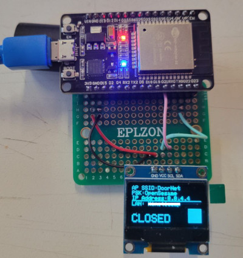
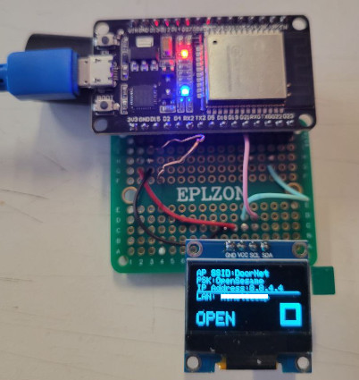

# ESP Door Buzzer
> [!NOTE]
> This repo is still in active development and not fully functional

There are two parts to this project.  This repository is being used to develop the part that resides on an ESP32.  I am in the early stages of developing it, so this repository will be mainly for my notes and stream of thought as it is developed.  Once it is functional, the repo will be fine-tuned to be fully functional and will include my notes related to any discoveries that may be useful for others using some of the functionality on the edges of what this project is being developed for.

This project is intended to streamline access into a shared space by interfacing with an electronically-controlled "buzz in" door lock.  Users of the space are members, patrons, and visitors.  Members have keys and permission from the organization to open the space and make it available to other members and to patrons in good standing.  At some times, the member(s) can and will allow visitors into the space as well.  This project will not give visitors access to the space.  This project will not bypass traditional security as far as the requirements of members to physically act within the space to authorize patrons to enter, and to enable the ESP32 to interface with the door lock.  

For the project to be successful (actually be used), it must require as little training as possible and must not require any software not commonly used by patrons or members - KISS.  The more steps in the process or the more training needed, the less this project will be used.  While users can connect to this project with tablets or laptops, the project is designed to be used primarily with smartphones.  Little, if any, testing will be performed to ensure compatibility with devices other than Android or Apple smartphones.

There are ways to make the end result of this project more secure than it will be.  These ways will not be implemented.  First - this project is not intended to give anyone access to the space without an attending member being present on site to perform final verification whether the patron is allowed to enter.  Each of the additional tools and techniques that will make the system more secure considered so far requires the user to receive more detailed training, and most of them require the user to install and/or learn additional software - this violates the KISS principle required to make it useful.

The member who is at the space and opens it up for members and patrons will flip a DPST or DPDT mechanical switch.  That switch will notify the ESP that a member is present and has opened the space, enabling control of the door.  It will also provide a mechanical disconnect between the ESP and the electronic door lock for added security.

### Operational Basics
1. Members and patrons will connect to an access point created by the ESP32.
1. The ESP will use a captive portal to direct the user to a webpage hosted by the ESP.  On that webpage, the user will enter authentication information.  
1. The ESP will query an external database to determine if the authenticated user is in good standing.
1. If the user is in good standing **and** a member has set the switch to the "open for patrons" position, the ESP will "buzz in" the user.
1. If the user is not buzzed in, they can ring the doorbell and a member can determine if the user can enter the space.
1. The ESP will operate as an Access Point *and* will be connected to the WiFi network internal to the space.  The second connection will allow the ESP to bridge the gap between the outside world and the space's much more secure network in order to provide very specific queries via API calls.

### Initial registration
1. The ESP will not know whether the phone that connects belongs to a registered user or not.
1. The user will connect to the ESP Access Point.  A QR code visible from the door can be used to offer access point and passcode information.
1. The user's device will automatically open the captive portal page, or will offer a one-click alert to open it.
1. The unregistered user will enter a username and password on the captive portal page, and will submit the form.
1. If the username is not in the user control database, the ESP will ask the user to re-enter the password.
1. If the passwords match, the username and password will be stored in the user database (not on the ESP itself)
1. The system will not grant access to the new user, so they will need to ring the doorbell, which is the current status quo.

### Authorization
1. A member who is authorized to do so will link the username created during initial registration to the organization's membership and dues database via user id.  This will allow the ESP to query whether the user is a member or patron in good standing.  Linking the username given the ESP to the user in the membership database is the entirety of the authorization process.
1. Once the user has been authorized, they will be permitted to "knock on the door" with the system.

### "Knock on the door"
1. The user will connect to the access point and enter their username.
1. The ESP will determine whether that username is associated with a registered user.
1. If properly associated, the ESP will present a webpage welcoming the user by name and ask for their password.
1. Once the ESP has the username and password, it will verify the user's status and buzz the door or tell the user to ring the doorbell.

## FUNCTIONS\COMPONENTS
- [x] Access point and station mode
- [x] Multiple LANs to choose from (mainly for my development)
- [x] Captive portal - *Requires DNS*
- [x] HTTP Server - *needed for captive portal*
- [x] HTTPS Server - *for security*
- [x] SSL Certificate handling/serving

**All above complete in 2023-09-05 sketch**  1.1MB of program storage and 53KB of dynamic memory.
- [x] OLED to notify users (members) without need for serial port connection
- [x] Physical DPDT/DPST switch - Read state and use to isolate buzzer output

**All above complete in 2023-09-06 sketch**  1,140,785 bytes of program storage space and 53,712 bytes of dynamic memory
- [ ] Integrate WS2812 to communicate when space is "open," and if spoofers have been detected
- [ ] Periodic scan of available SSIDs (look for spoofers) - Hopefully without dropping LAN (preferred to drop) or Access Point
- [ ] Captive portal needs to redirect to HTTPS page(s)
- [ ] Update pages served to perform registration/knocking functions
- [ ] Spec API query and response
- [ ] Identify BKM for users to trust ESP SSL Cert
- [ ] Disconnect users after they have finished their interaction
- [ ] Spec best approach for user database - SPIFFS, external
- [ ] Is HTTPS sufficiently secure, or should I add 2FA (text registered phone number)? - maybe include as an option, which users can configure/choose at compile time
- [ ] Provide options for owners to select/define SSIDs and passwords without having to recompile (saved to ESP)

## NOTES
1. As of Sept. 5 2023, I have been able to integrate the ESP joining a WiFi network, offering an Access Point to users, serving both HTTP and HTTPS pages and triggering a captive portal response in Windows, Ubuntu and Android.  As of last compile, the sketch only uses 1.1MB of program storage and 53KB of dynamic memory.  Since the plan is to use the "Huge APP (3MB No OTA/1MB SPIFFS)" option, there is ample room to include the additional functionality the project requires.

1. As of Sep. 6 2023, I have integrated an SSD1306 128x64 OLED, and the OLED notifies the user of the current status of network connections and whether the space is "open" by reading the state of the switch.  The OLED I am using uses SPI address 0x3C, not the usual 0X3D.
   

1. Determine if the ESP32 captive portal will work with HTTPS.  Standard captive portals spawn an HTTP connection, which then redirects to an HTTPS.

1. Determine if HTTPS is sufficiently secure and meets the KISS requirements of the project, or use 2FA by sending a four digit pass code (short lifespan, one time use) to the phone number registered to the user.  Certificate management to create the trust relationship for HTTPS may violate KISS.

